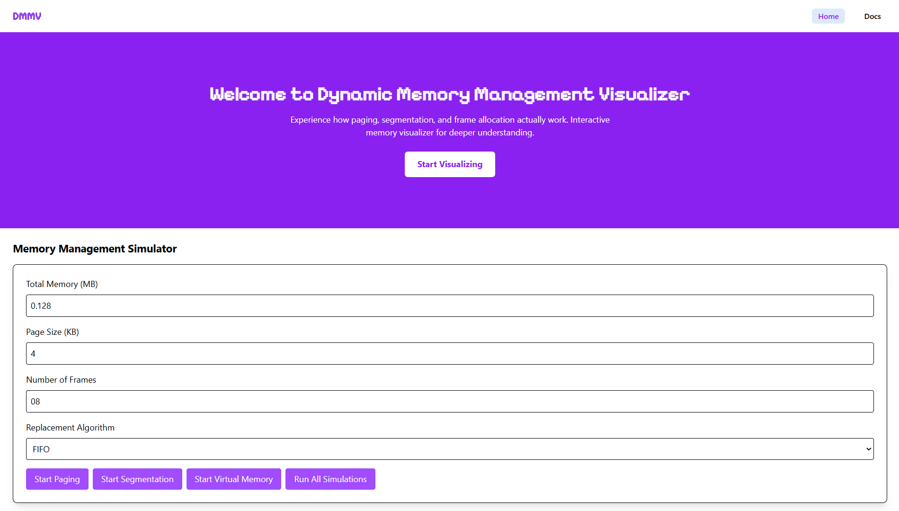
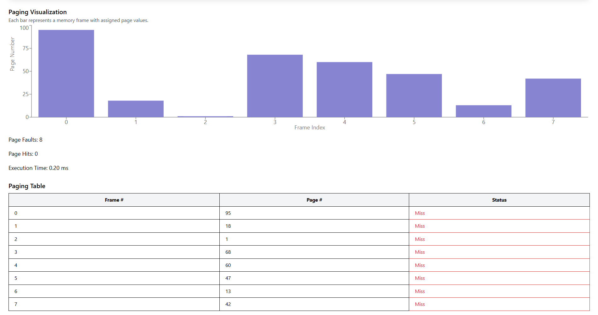
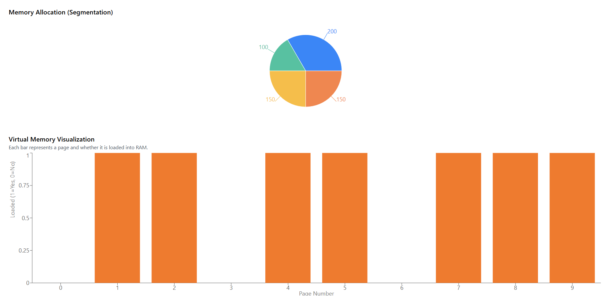

# Dynamic Memory Management Visualizer

A web-based interactive visualization tool for simulating different memory management techniques, including Paging, Segmentation, and Virtual Memory.

## Features
- **Paging Simulation**: Visualizes memory frames and page replacements using FIFO and LRU algorithms.
- **Segmentation Simulation**: Demonstrates memory allocation based on segments like Code, Stack, Heap, and Data.
- **Virtual Memory Simulation**: Simulates page loading into RAM.
- **Interactive Graphs**: Uses `recharts` for graphical representation.
- **User Configurable**: Allows setting total memory, page size, and replacement algorithms.

## Folder Structure
```
DynamicMemoryManagementVisualizer/
│-- assets/
│   │-- 1st.png
│   │-- 2nd.png
│-- node_modules/
│-- public/
│   ├── index.html
│-- src/
│   │-- components/ui/
│   │   │-- button.js
│   │   │-- card.js
│   │-- input.css
│   │-- output.css
│   │-- simulation.js  # Main simulation logic
│   │-- App.js         # Main entry component
│   │-- index.js       # React entry point
│-- package.json
│-- README.md
```

## Screenshot





## Installation
1. Clone the repository:
   ```bash
   git clone https://github.com/your-username/DynamicMMVisualizer.git
   cd DynamicMMVisualizer
   ```
2. Install dependencies:
   ```bash
   npm install
   ```
   ```bash
   npm install react-router-dom recharts tailwindcss postcss autoprefixer
   ```
   ```bash
   npm install react-scripts --save
   ```
   ```bash
   npx @tailwindcss/cli -i ./src/input.css -o ./src/output.css --watch
   ```
   
3. Start the development server:
   ```bash
   npm start
   ```
## Langauges Used
- JavaScript
- HTML
- CSS

## Framework & Library Used
- React.js
- Tailwind CSS
- Recharts

## Usage
1. Set memory configuration (total memory, page size, replacement algorithm).
2. Click on **Start Paging**, **Start Segmentation**, or **Start Virtual Memory**.
3. View the visualized memory management process.
4. Click **Run All Simulations** to execute all at once.

## Contributing
Feel free to fork this project and submit pull requests with improvements!

## License
This project is open-source and available under the MIT License.

---
💻 **Developed by CodeByAshuu**
